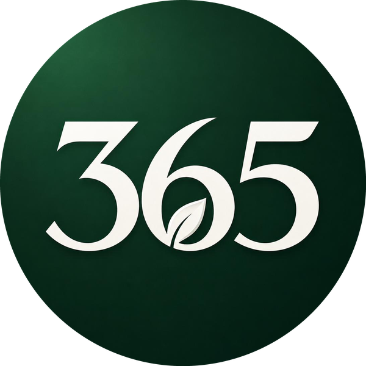

# Green365 (G365)
### 365 — One Green Action Every Day

*An Ethereum environmental community token built around one simple mission: One Green Action Every Day.*

 

 

**Contract Address**

[`0xa46b8c767d7a3881ec5c09857b96d245e4b9a6a9`](https://etherscan.io/token/0xa46b8c767d7a3881ec5c09857b96d245e4b9a6a9)

 

Phase 1 has no promised utility. Phase 2 represents a possible future direction and is funding-dependent.

**Not financial or legal advice.** Community first. Transparency always.
